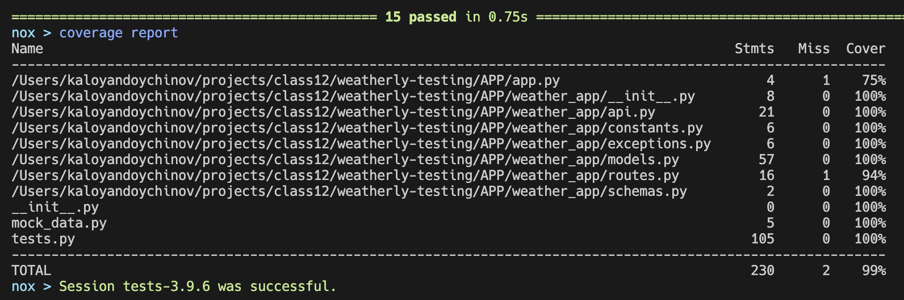
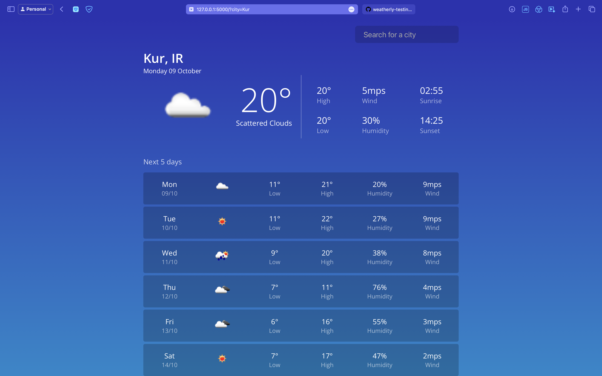

# Docker-Flask-WebApp

Flask web app with Docker

## How to run the project?

1. Navigate to the project `APP` folder
1. Run `docker build -t flask-app .`
1. Run `docker run -it --name flask-app-container -p 5000:5000 -d flask-app`
1. Go to `localhost:5000` in the browser

## How to run the tests?

1. Navigate to the project `APP/tests` folder
1. Run `nox -- tests.py`

## Results

