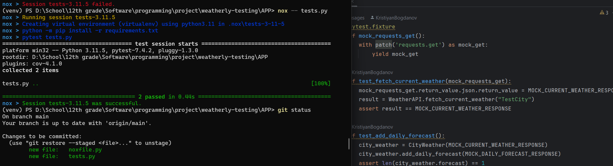

# Docker-Flask-WebApp
Flask web app with Docker

How to run the project?

1) Navigate to the project `APP` folder
1) Run `docker build -t flask-app .`
2) Run `docker run -it --name flask-app-container -p 5000:5000 -d flask-app`
3) Go to `localhost:5000` in the browser

Result:

And test coverage:

